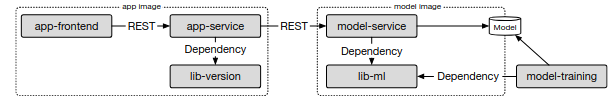

# Operation repository
This repository contains all information about the project progress for team 5 of the REMLA course, including PR's per person in `ACTIVITY.md` and general comments about each assignment in `review.txt`.

First the steps to run the application are listed, then the project contents are explained in a bit more detail.

## Running the application

To run using Docker, login to github package repository and compose containers:

```
docker login https://ghcr.io
docker compose up
```

To run a Kubernetes cluster in the VMs, run the following command:

```
vagrant up
```

DISCLAIMER: this does not work currently [21-5-2024]

## The project
The project concerns the training and deployment of a Phishing URL detector as a web application. The project consists of multiple repositories, each with their own focus, working together to create the full application. The architecture looks as follows:



Below the contents of each repository are briefly mentioned.

### model-training
The [`model-training`](https://github.com/REMLA24-Team-5/Model-Training) repository contains the following:
- the pipeline to train a model for Phishing URL detection
- The trained model is stored in an accessible location ([here](https://drive.google.com/file/d/185n3q-K-l3eiFwiThouljU_j9rYDugIX)) 
- a preprocessing step that is imported through `lib-ml` 
- a GitHub workflow checks the code quality with two linters (Pylint and Bandit), which fail the build if the scores are not perfect

### model-service
The [`model-service`](https://github.com/REMLA24-Team-5/model-service) repository contains the following:
- a queryable environment that fetches the model trained in `model-training`
- also uses `lib-ml` for preprocessing of the input
- an embedded ML model using Flask
- A GitHub workflow that automatically versions and releases the image in the GitHub container registry

### lib-ml
The [`lib-ml`](https://github.com/REMLA24-Team-5/lib-ml) repository contains the following:
- the preprocessing logic needed before training or using models
- A GitHub workflow that automatically versions and releases the library in a package registry

### app
The [`app`](https://github.com/REMLA24-Team-5/app) repository contains the following:
- an `app-frontend` that contains the frontend of the application
- an `app-service` that queries the `model-service`
- A GitHub workflow that automatically versions and releases the image in a package registry

### lib-version
The [`lib-version`](https://github.com/REMLA24-Team-5/lib-versino) repository contains the following:
- a VersionUtil class that can be asked for its version
- a GitHub workflow that automatically versions and releases the library in a package registry

