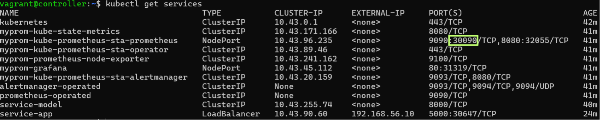
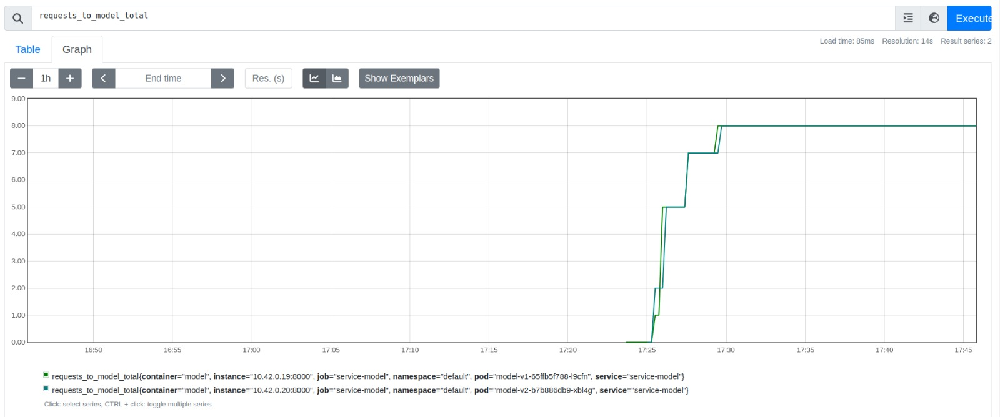
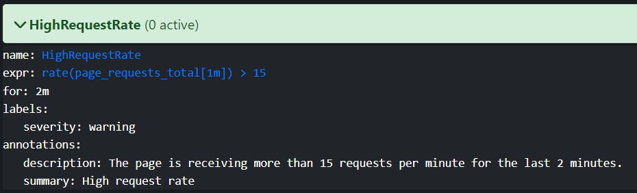
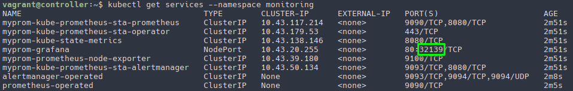
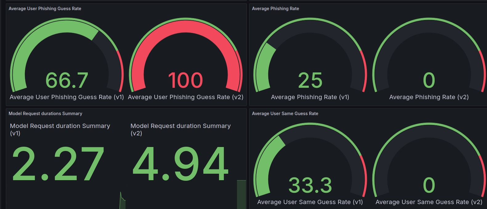
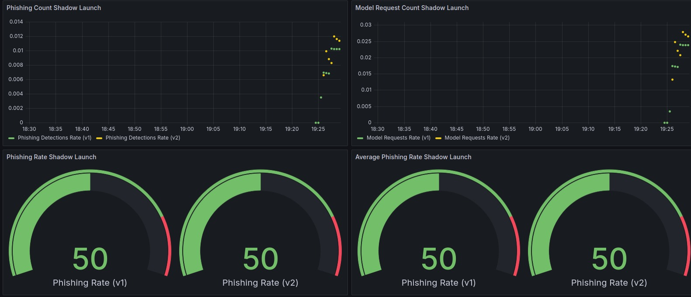

# Operation repository
This repository contains all information about the project progress for team 5 of the REMLA course, including PR's per person in `ACTIVITY.md` and progress for each assignment in `review.md`. The latter file lists all the things that have been implemented according to the rubric per assignment.

First the steps to run the application are listed, then the project contents are explained in a bit more detail.

## Running the application
To run using Docker, login to github package repository and compose containers, see the commands below. The `compose.yml` file includes a port mapping for both the `model-service` and `app`. Also an environment variable is present for the URL where the model can be queried. A volume mapping could be easily implemented (see [here](https://docs.docker.com/storage/volumes/)) for the model and/or training data, however currently this is not done since the data is downloaded from Google Drive.

```
docker login https://ghcr.io
docker compose up
```

To run a Kubernetes cluster in a configurable number of VMs, simply run the following command:

```
vagrant up
```

The number of worker nodes can be specified at the top of the Vagrantfile (line 5). If you now want to interact with the cluster, run the following command on the host (from the main directory of this repository):

```
export KUBECONFIG=./playbooks/k3s.yaml
```

or this command when in the cluster (i.e. when ssh-ed into a node)
```
export KUBECONFIG=/vagrant/playbooks/k3s.yaml
```

Now you can use the `kubectl` command as you are used to. The following commands can be used to investigate the cluster
- `kubectl get nodes` to list all running nodes, this should be the control-plane and the number of worker nodes that you configured
- `kubectl get pods` to list all running pods in the default namespace, to see all pods run include the `--all-namespaces` flag
- `kubectl get services` to list all services, this will be used in the section below

These are the most basic ones, a lot more information can be extracted from the cluster. For an overview of all commands, please visit [this](https://kubernetes.io/docs/reference/generated/kubectl/kubectl-commands)
 page.

## Prometheus Dashboard
The application is monitored through many metrics. To see these metrics we need to open Prometheus. For this first export the KUBECONFIG (if not done already) and the list the services:

```
    export KUBECONFIG=./playbooks/k3s.yaml
    kubectl get services
```

You should look for the Prometheus port, which you can use to enter Prometheus using the IP of the controller node. This IP is set to 192.168.56.10.



Inside Prometheus you can query app specific metrics such as `requests_to_model_total`. Selecting this metric in the Prometheus page allows you to see its value progress over time, as can be seen in the figure below (note there are two models, this will be explained in the Istio section).



Prometheus is also setup with an Alermanager, such that an alert is raised when more than 15 request are received for the last two mintues. The message that pops up looks as follows:



## Grafana Dashboard
The reported metrics can be visualized through Grafana. To open the Grafana dashboard you first need to export the KUBECONFIG (if not done already) and list the services:

```
    export KUBECONFIG=./playbooks/k3s.yaml
    kubectl get services
```

You should look for the grafana port, which you can use to enter Grafana using the IP of the controller node. This IP is set to 192.168.56.10.



You will then be redirected to a login page, where the username and password are both `admin`. Inside Grafana you can create new dashboards or look at our `Custom Metrics Dashboard`, which is loaded from a json file. A part of the Dashboard looks as follows:



Notice that the metrics appear twice for every category, this is because of the two versions of the app being up.

## Istio Implementations
With the use of Istio we run two versions of the app by default. The difference between these versions is the color of the buttons when the user is asked about his/her opinion on whether a URL is phishing or not. Metrics for both these app versions are collected and can be seen when visiting the `Custom Metrics Dashboard`.

Additionally a shadow launch for the `model-service` is implemented, where two different versions of the trained model are used. All requests sent to the original model are also sent to the newly trained model. The `Custom Metrics Dashboard for Shadow Launch` can be used to compare the model performances and assess whether the new model can be used. A part of the dashboard for this looks as follows:



In the figure you can clearly see the two different versions of the model (v1 and v2).

## The project
The project concerns the training and deployment of a Phishing URL detector as a web application. The project consists of multiple repositories, each with their own focus, working together to create the full application. The architecture looks as follows:


This repository is the entrypoint to the project and contains all information needed. Below the contents of the other repositories are briefly mentioned. Additionally a report has been written that covers all details in a lot more depth, this can be found in the `/assets` folder of this repository.

### model-training
The [`model-training`](https://github.com/REMLA24-Team-5/Model-Training) repository contains the following:
- the pipeline to train a model for Phishing URL detection
- The trained model is stored in an accessible location ([here](https://drive.google.com/file/d/185n3q-K-l3eiFwiThouljU_j9rYDugIX)) 
- a preprocessing step that is imported through `lib-ml` 
- a GitHub workflow checks the code quality with two linters (Pylint and Bandit), which fail the build if the scores are not perfect
- a testing pipeline that checks if all parts work as intended using pytest

### model-service
The [`model-service`](https://github.com/REMLA24-Team-5/model-service) repository contains the following:
- a queryable environment that fetches the model trained in `model-training`
- also uses `lib-ml` for preprocessing of the input
- an embedded ML model using Flask
- A GitHub workflow that automatically versions and releases the image in the GitHub container registry

### lib-ml
The [`lib-ml`](https://github.com/REMLA24-Team-5/lib-ml) repository contains the following:
- the preprocessing logic needed before training or using models
- A GitHub workflow that automatically versions and releases the library in a package registry

### app
The [`app`](https://github.com/REMLA24-Team-5/app) repository contains the following:
- an `app-frontend` that contains the frontend of the application
- an `app-service` that queries the `model-service`
- A GitHub workflow that automatically versions and releases the image in a package registry

### lib-version
The [`lib-version`](https://github.com/REMLA24-Team-5/lib-versino) repository contains the following:
- a VersionUtil class that can be asked for its version
- a GitHub workflow that automatically versions and releases the library in a package registry

## File structure
The entire file-structure of the repository including explanations per file can be found below.
```
├── assets                          -> folder containing supporting asset files
│   ├── report.pdf                  -> report pdf
│   ├── alertmanager.jpeg           -> image used in README
│   ├── architecture.png            -> image used in README
│   ├── grafana-port.png            -> image used in README
│   └── prometheus-port.png         -> image used in README
├── kubernetes                      -> folder containing all Kubernetes deployment files
│   ├── app.yml                     -> deployment file for the app
│   ├── environment.yml             -> ConfigMap to store the model-service URL
│   ├── grafana-value.yml           -> contains default settings for the Grafana Dashboard
│   ├── ingress.yml                 -> deployment file for an ingress
│   ├── istio.yml                   -> defines Istio objects for different app versions
│   ├── model-service.yml           -> deployment file for model-service
│   └── prometheus-value.yml        -> contains default settings for Prometheus
├── monitoring                      -> folder containing monitoring specific yaml files
│   ├── monitoring.yml              -> used to start a ServiceMonitor
│   └── prometheus_rule.yml         -> defines a PrometheusRule to send alerts
├── operation
├── playbooks                       -> folder containing playbooks for provisioning
│   ├── grafana-config.yaml         -> defines the custom dashboards
│   └── setup_k8s_cluster.yml       -> playbook that sets up the whole Kubernetes cluster
├── volume                          -> volume folder containing necessary files
│   ├── model-v1.joblib             -> version one of the model
│   ├── model-v2.joblib             -> version two of the model
│   ├── test.txt                    -> file for model testing
│   ├── train.txt                   -> file for model trainig
│   └── val.txt                     -> file for model validation
├── .gitignore                      -> contains files which Git should ignore
├── ACTIVITY.md                     -> lists team member's activity per assignment
├── README.md                       -> general README of the repository
├── Vagrantfile                     -> used to define and start VMs
├── compose.yml                     -> Docker compose file to start the application
└── review.md                       -> file containig progress for each rubric
```